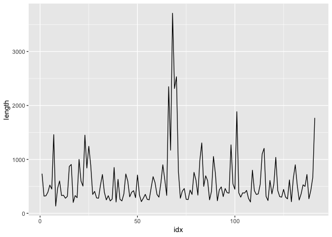
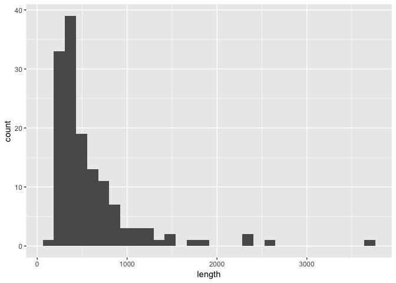
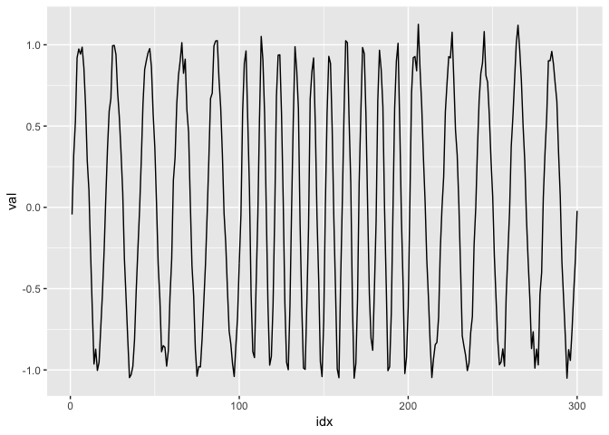
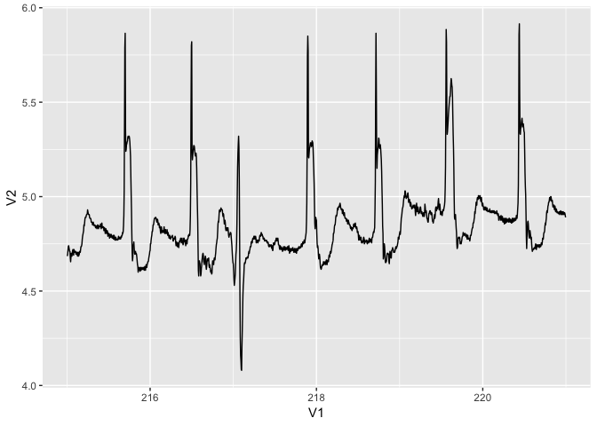

本ドキュメントでは、

井出剛「入門 機械学習による異常検知」コロナ社 7章 時系列データの異常検知

で示されている、時系列データの異常検知の例のデータセットを示す。

(a) 外れ値型
============

    summary(rivers)

    ##    Min. 1st Qu.  Median    Mean 3rd Qu.    Max. 
    ##   135.0   310.0   425.0   591.2   680.0  3710.0

    df_river <- data.frame(c(1:length(rivers)), rivers)
    colnames(df_river) <- c("idx", "length")
    head(df_river)

    ##   idx length
    ## 1   1    735
    ## 2   2    320
    ## 3   3    325
    ## 4   4    392
    ## 5   5    524
    ## 6   6    450

    ggplot(
      df_river,
      aes(
        x = idx,
        y = length
      )
    ) + geom_line()

    ggplot(df_river,aes(x=length)) + geom_histogram()

    ## `stat_bin()` using `bins = 30`. Pick better value with `binwidth`.

(b) 逸脱型
==========

TODO

(c) 変化点型(周波数変化データ)
==============================

    set.seed(1)
    tt <- 0.1
    x1 <- seq(0,10,by=tt)
    x2 <- seq(10.1,20,by=tt)
    x3 <- seq(20.2,30,by=tt)
    y1 <- sin(pi*x1) + rnorm(length(x1), sd=0.07)
    y2 <- sin(2*pi*x2) + rnorm(length(x2), sd=0.07)
    y3 <- sin(pi*x3) + rnorm(length(x3), sd=0.07)
    xi <- c(y1,y2,y3)
    df_xi <- data.frame(c(1:length(xi)), xi)
    colnames(df_xi)=c("idx", "val")
    head(df_xi)

    ##   idx         val
    ## 1   1 -0.04385177
    ## 2   2  0.32187203
    ## 3   3  0.52929125
    ## 4   4  0.92068665
    ## 5   5  0.97412206
    ## 6   6  0.94256721

    ggplot(
      data.frame(df_xi),
      aes(
        x = idx,
        y = val
      )
    ) + geom_line()

(d) 複合型(心電図データ)
========================

心電図データはこちらからダウンロード
<https://www.cs.ucr.edu/~eamonn/discords/>

    df_ecg <- read.table(file="qtdbsel102.txt")
    head(df_ecg)

    ##        V1    V2    V3
    ## 1 200.000 4.770 2.100
    ## 2 200.004 4.820 2.135
    ## 3 200.008 4.805 2.190
    ## 4 200.012 4.750 2.285
    ## 5 200.016 4.710 2.440
    ## 6 200.020 4.695 2.620

    ggplot(
      df_ecg %>% dplyr::filter(V1>215 & V1<221),
      aes(
        x = V1,
        y = V2
      )
    ) + geom_line()

